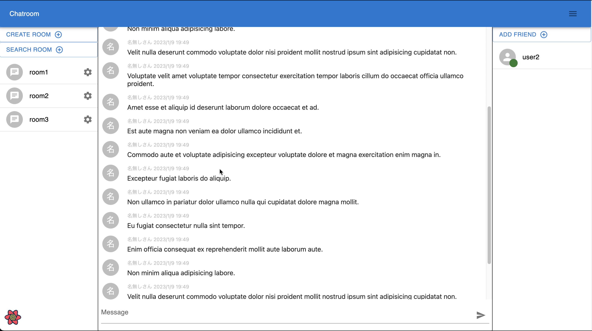

# ft_transcendence

This is a real-time multiplayer online game where multiple players can compete in the classic game of Pong.

https://user-images.githubusercontent.com/64348608/218266302-9158260a-9d8b-4713-9cce-5fdb6700310e.mp4




## Technologies Used
- Backend: NestJS
- Frontend: Next.js
- Frontend Library: Material-UI
- Database: PostgreSQL
- ORM: Prisma
- Real-time Communication: Socket.io


## Features

- Game
  - Two-player mode
  - Simple, intuitive controls
  - Choose from different levels of difficulty and scores
  - Rankings based on scores
  - Spectate live games
- Chat
  - Public, private, and password-protected chat rooms
  - Direct messaging
  - Block and report users
  - Admins and chat room owners can mute, ban, or kick users
- Login
  - Google and 42 login integration for easy access
  - Two-factor authentication (can be enabled from the settings)

## Getting Started

To start the app, run the following command:

```bash
docker-compose up --build
```
This will set up the database and start the app.


To set up either Google or 42 login, add the following information to the backend's .env file:

- GOOGLE_CLIENT_ID
- GOOGLE_SECRET
- FORTYTWO_CLIENT_ID
- FORTYTWO_SECRET

## How to Play

1. Match with another player
2. Choose a difficulty level and set score
3. Use your paddle to hit the ball and prevent it from hitting the bottom of the screen
4. The first player to reach the set score wins
5. Check your ranking on the leaderboard

Enjoy both the game and the chat!

## Author

- [rakushoo](https://github.com/rakushoo)
- [takashi247](https://github.com/takashi247)
- [ryo-manba](https://github.com/ryo-manba)
- [yuta-fujimoto](https://github.com/yuta-fujimoto)
